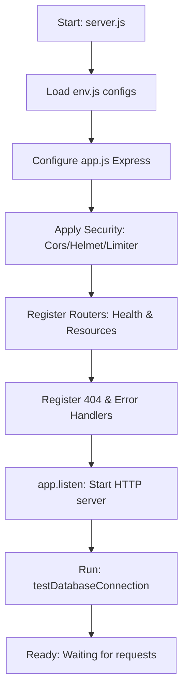

# 18 — Backend API Foundation
## Quantum Mentor World | Quantum Mentor Official

---

## Overview

The backend component for **Quantum Mentor World** is built using **Node.js** and **Express.js**, designed to manage secure, rate-limited public reads and administrative workflows. This document explains the codebase foundation created in Step 7.

---

## 1. Directory Structure

```text
backend/
├── config/
│   ├── env.js                # Loads and validates .env parameters
│   └── db.js                 # Configures MySQL connection pool (mysql2/promise)
├── controllers/
│   └── health.controller.js  # Implements API/DB status reporting functions
├── middleware/
│   ├── error.middleware.js   # Catches and formats unhandled system exceptions
│   ├── not-found.middleware.js # Standardizes unmatched route responses to 404
│   ├── security.middleware.js # Sets up Helmet, CORS parameters, and global Rate Limiting
│   └── validation.middleware.js # Intercepts input validation errors
├── routes/
│   ├── health.routes.js      # Mapped to /api/health and /api/health/database
│   └── *.routes.js           # 15 placeholder route files
├── utils/
│   ├── asyncHandler.js       # Higher-order wrapper to handle async promises
│   ├── constants.js          # Defines database-mapped ENUM lists
│   ├── logger.js             # Standard logging configuration (timestamp prefixed)
│   └── response.js           # Standardizes JSON success/error response helpers
├── app.js                    # Express application mounting and setup
└── server.js                 # Boots the HTTP server
```

---

## 2. Server Startup Flow



---

## 3. Environment & MySQL Configuration

### Environment config (`config/env.js`)
Aggregates parameters using `dotenv` with safe default fallbacks. It prevents sensitive parameters (such as `DB_PASSWORD` or `JWT_SECRET`) from showing up in logging consoles.

### Database Connection Pool (`config/db.js`)
Configured using `mysql2/promise` with the following parameters:
* **Max Connections:** 10
* **Safety Rules:** Parameterized queries only (using `query(sql, params)` helper).
* **Connection Check:** Non-fatal startup test running `SELECT 1 AS test` and checking count of tables.

---

## 4. Key Middleware Configuration

* **Helmet:** Adds standard HTTP headers for protecting against cross-site scripting (XSS), padding, and protocol sniffing.
* **CORS:** Restricts connections to allowed local hosts (`localhost:3000`, `localhost:5500`, `127.0.0.1:5500`, and `FRONTEND_URL` environment variables).
* **Rate Limiter:** Applies a threshold of 100 requests per 15 minutes per IP to protect from brute-force/DoS attacks.
* **Not Found Handler:** Converts unmatched routes into standardized 404 JSON responses.
* **Global Error Middleware:** Captures controller failures, redacts detailed stack traces in production mode, and formats errors into standardized API structures.

---

## 5. Standard Route Endpoints

| Method | Endpoint | Description | Status |
|---|---|---|---|
| **GET** | `/api` | Base welcome index | Working |
| **GET** | `/api/health` | API system status | Working |
| **GET** | `/api/health/database` | Database connectivity check | Working |
| **GET** | `/api/software` | Software resources placeholder | Placeholder |
| **GET** | `/api/resources` | General resources placeholder | Placeholder |
| **POST** | `/api/contact` | Public contact message placeholder | Placeholder |
| **GET** | `/api/admin` | Protected dashboard placeholder | Placeholder |

---

## 6. How to Run & Test the Backend

### Local Server Setup
1. Navigate to the backend folder:
   ```bash
   cd backend
   ```
2. Copy environmental variables:
   ```bash
   copy .env.example .env
   ```
3. Start the node server in development mode:
   ```bash
   npm run dev
   ```

### Command-Line Query Testing
Use PowerShell or cURL to query backend routes:
```powershell
# Get base welcome message
Invoke-RestMethod -Uri http://localhost:5000/api

# Check MySQL connectivity status
Invoke-RestMethod -Uri http://localhost:5000/api/health/database
```

---

## 7. Next Actions in Step 8
In **Step 8: MySQL Model Layer and Public Resource Read APIs**, we will:
* Build the model abstractions for database reads (selecting published, approved, and safe resources only).
* Implement controllers for categories, tags, and resources lists/details.
* Connect routes to live MySQL queries.
