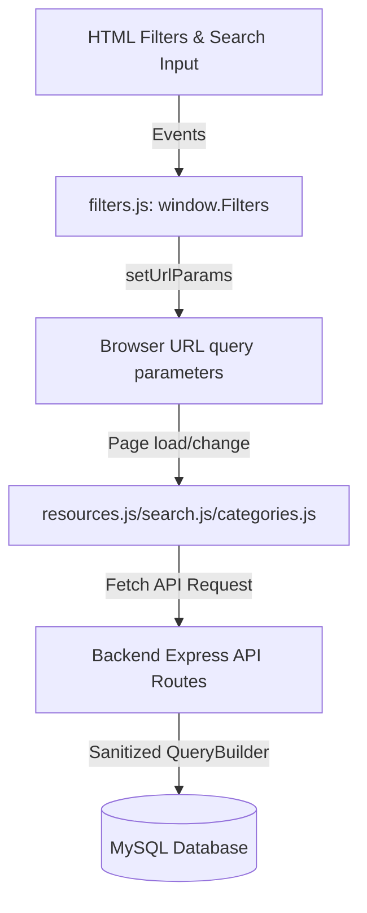

# 26 — Search, Filters, Categories, and Tags Guide
## Quantum Mentor World | Quantum Mentor Official

---

## 1. Overview

To provide an optimized and secure exploration experience, **Quantum Mentor World** features a robust search, filtering, and classification system. Users can filter resources by Category, Tag, Access Type (e.g. Free, Paid, Freemium), and Source Type (e.g. Official, Open Source, Freeware), sort results dynamically, and navigate using URL-synchronized state chips.

---

## 2. Architecture & Components

The search and filtering architecture is split between a stateless, parameterized database controller and a dynamic URL-driven frontend orchestrator.



### Key Frontend Components:
1. **`filters.js` ([filters.js](file:///g:/Projects/Quantum%20Mentor%20Web%20For%20custom%20Part%202/frontend/assets/js/filters.js)):** Manages sync state between UI controls and the URL query parameters.
2. **`resources.js` ([resources.js](file:///g:/Projects/Quantum%20Mentor%20Web%20For%20custom%20Part%202/frontend/assets/js/resources.js)):** Handles fetching resources based on URL query parameters and rendering resource cards in the grid.
3. **`categories.js` & `tags.js` ([categories.js](file:///g:/Projects/Quantum%20Mentor%20Web%20For%20custom%20Part%202/frontend/assets/js/categories.js), [tags.js](file:///g:/Projects/Quantum%20Mentor%20Web%20For%20custom%20Part%202/frontend/assets/js/tags.js)):** Control rendering for the main index pages and detail landing pages for specific categories and tags.

---

## 3. URL Synchronization & State Management

All active search terms, selected categories, tags, access methods, and sorting preferences are stored directly in the browser's URL search query string. 

### Benefits:
* **Deep Linking:** Users can share a URL with filters pre-applied (e.g., `software.html?q=editor&access_type=free&sort=popular`).
* **Refresh Resilience:** Reloading the page retains the exact state and layout of search results.
* **Unified State:** No complex frontend framework store is needed; the URL acts as the single source of truth.

### Chip Management Lifecycle:
* **Creation:** When a query parameter is added, a UI badge (chip) is generated under the filter bar displaying the filter name and value.
* **Removal:** Clicking the `×` on a chip updates the URL (removing that parameter) and re-fetches the page without a full reload.
* **Clear Filters:** A global "Clear Filters" button removes all search/filtering parameters, returning the directory to its default listing state.

---

## 4. Backend Database Queries & Filtering

The MySQL backend handles search queries using a sanitizing query builder to prevent SQL injections. It constructs SQL queries dynamically based on safe parameter validation.

### SQL Filtering Patterns:
1. **Full-Text and Substring Search:**
   ```sql
   SELECT r.* FROM resources r 
   WHERE (r.title LIKE ? OR r.description LIKE ?) 
   AND r.status = 'published' AND r.legal_status = 'approved' AND r.safety_status IN ('safe', 'caution')
   ```
2. **Category / Tag Joins:**
   ```sql
   SELECT r.* FROM resources r
   INNER JOIN resource_categories rc ON r.id = rc.resource_id
   INNER JOIN categories c ON rc.category_id = c.id
   WHERE c.slug = ?
   ```

### Enforcing Safety Rules:
All public search queries strictly append the `PUBLIC_RESOURCE_CONDITION` constraints:
* **`status`** must be `'published'`.
* **`legal_status`** must be `'approved'`.
* **`safety_status`** must NOT be `'unsafe'`.

---

## 5. Security & Input Escaping

To prevent cross-site scripting (XSS) and SQL injection:
1. **SQL Parameters:** Raw query string variables are never concatenated directly into SQL statements. All filters pass through the db pool parameters array `db.query(sql, [param1, param2])`.
2. **DOM Escaping:** Dynamic text from search results is escaped using the `window.UI.escapeHtml()` utility before injection into the DOM.
3. **Validation:** Parameters like `sort`, `access_type`, and `source_type` are matched against an internal white-list of acceptable enums. Invalid configurations are discarded or defaulted.
